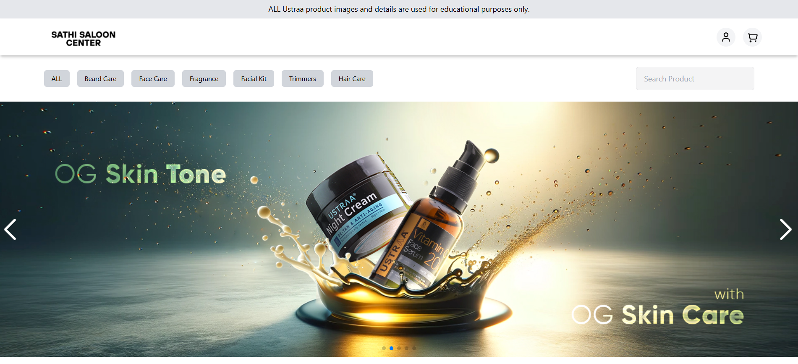
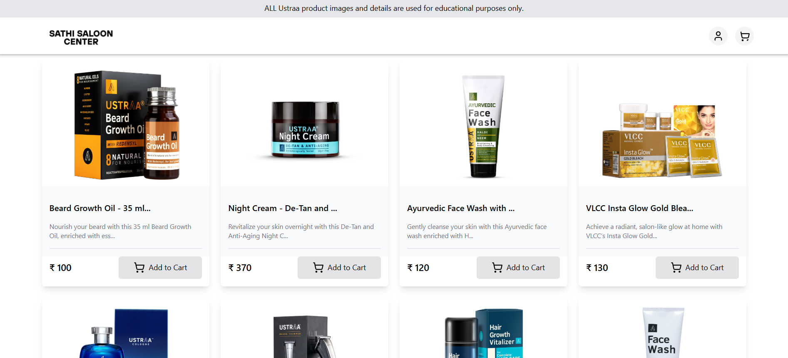
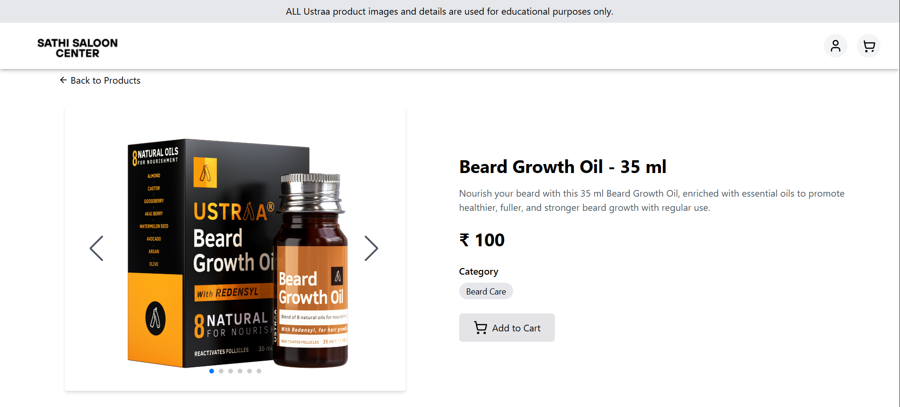

# 💈 Sathi Saloon Center

A modern and responsive frontend project simulating a saloon product showcase, built using **React**, **Tailwind CSS**, and **Redux Toolkit**. This is a personal learning project and does **not provide any real services**.

---

## 🚀 Features

- 💇 Display of men's grooming products
- 🖼️ Product cards with images, names, and prices
- 🌀 Carousel integration using Swiper
- 🔍 Filtered product views using Redux
- 🛒 Cart functionality UI
- 📱 Mobile-first, fully responsive UI with Tailwind CSS
- ⚡ Clean and modern component-based design using React

---

## 📸 Demo

> 🔗 **Live Demo:** [https://sathi-saloon-center.netlify.app/](https://github.com/kaif13/Sathi-saloon-center)

### 🏠 Home Page (Header + Product Section)




### 📄 Product Detail Page



### 🛒 Cart Page


---

## 🛠️ Tech Stack & Dependencies

```json
"dependencies": {
  "@reduxjs/toolkit": "^2.8.2",
  "lucide": "^0.525.0",
  "lucide-react": "^0.525.0",
  "react": "^19.1.0",
  "react-dom": "^19.1.0",
  "react-redux": "^9.2.0",
  "react-router-dom": "^7.6.3",
  "swiper": "^11.2.10"
}
```

Other tools used:

- **Vite** – Lightning-fast frontend build tool
- **Tailwind CSS** – Utility-first CSS framework

---

## ⚙️ Getting Started

1. **Clone the repository**

```bash
git clone https://github.com/kaif13/Sathi-saloon-center
cd sathi-saloon-center
```

2. **Install dependencies**

```bash
npm install
```

3. **Start the development server**

```bash
npm run dev
```

4. Open `http://localhost:5173` in your browser.

---

## 📌 Disclaimer

This project is for **educational/demo purposes only**.

- I am **not providing any real services**.
- All product images, names, and references are based on **Ustraa** products.
- Ustraa and any other brands used have **no affiliation or endorsement** of this project.
- All copyrights belong to their respective owners.

---

## 📝 License

This project is licensed for personal and non-commercial use only.
